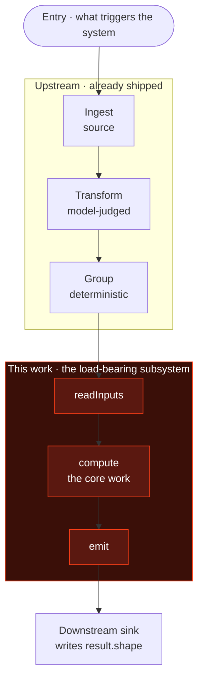
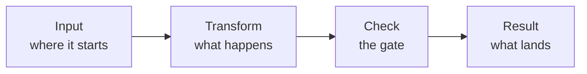
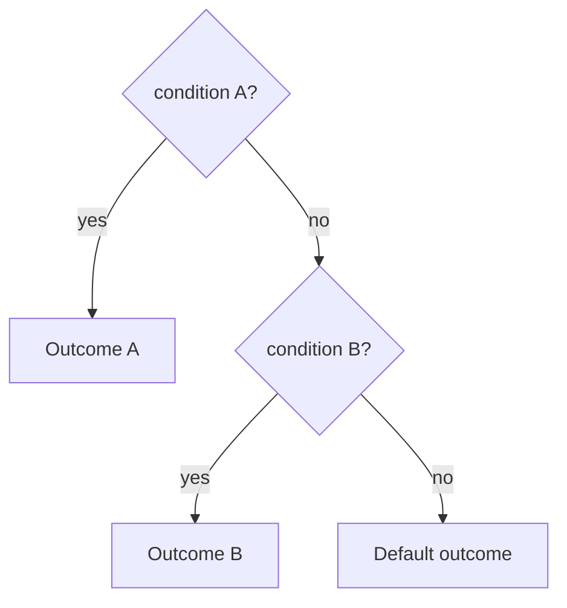
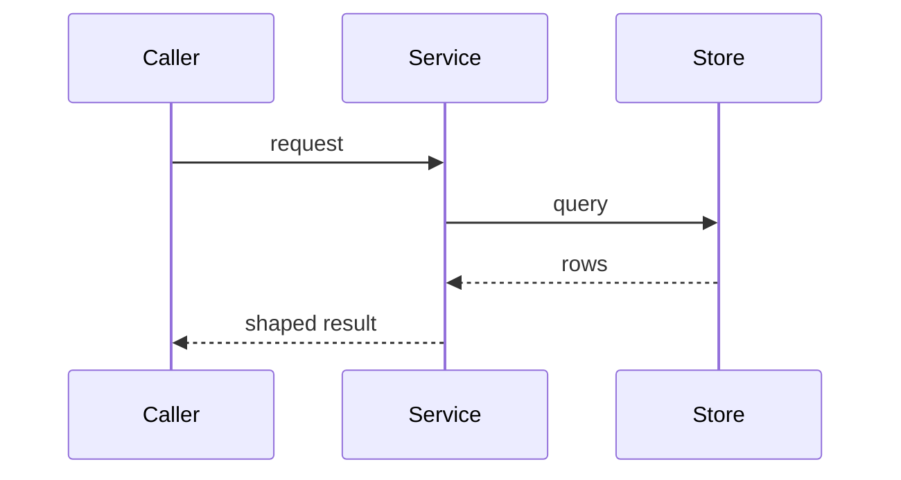

<!--
  md-presentation TEMPLATE
  ─────────────────────────
  Copy this file, rename it, fill in slides. No render step — the .md IS the
  deliverable. mermaid blocks render live in GitHub / VS Code / Obsidian.

  • One "slide" per section, separated by a --- horizontal rule.
  • 8–12 slides. Slide 1 is the title; SLIDE 2 is the whole-system
    architecture overview (## 01 below); the last is synthesis / next steps.
  • Each slide: ## NN · label  →  ### claim-headline  →  (optional framing
    sentence)  →  visual (mermaid or ASCII)  →  > single-punch takeaway.
  • Delete the example slides you do not need; keep the structure.
-->

# Deck Title Here

One-line subtitle — what the reader will be able to *think* about afterward.

`Primary tag` · `Context` · `Scope / key fact`

---

## 01 · The whole system

### Where this work sits — the map before the parts

Slide 2 is always the overview: a top-down diagram of the whole subject, with
THIS deck's piece highlighted as the focus node and everything else as quiet
context. Show it first so the reader has a frame for every later slide.



> **Invariant:** the one cross-cutting property that must hold end to end.

---

## 02 · Section label

### A headline that states a claim, not a topic

A pipeline reads as causation — use `flowchart LR` only when each node truly
produces the next. (Drop this framing line whenever the heading + diagram
already land the point.)



> **Takeaway:** the one sentence the reader should leave this slide holding.

---

## 03 · Resolution logic

### Use a decision tree for precedence — first match wins

Good for role resolution, routing, fallback chains. Name the default branch
explicitly — an unstated fall-through hides a case.



> **Takeaway:** state what the precedence order protects against.

---

## 04 · Why this, not that

### Use a table when the idea is "two things differ"

Tables render everywhere and diff cleanly — prefer them for structured
comparisons over ASCII columns.

| Aspect        | Rejected / old way        | Chosen / new way            |
|---------------|---------------------------|-----------------------------|
| Mechanism     | how the old one worked    | how the new one works       |
| Failure mode  | the specific way it fails | why the new one avoids it   |
| Verdict       | ✗ does not work because…  | ✓ works because…            |

> **The lesson:** the general principle the contrast illustrates.

---

## 05 · The number that matters

### A gauge shows a value against a threshold

For scores, budgets, gates. ASCII keeps it readable in every viewer — fence it
as a plain code block so it is never reflowed.

```
boundary precision

0.0                                                      1.0
├────────────────────────────────────────────────────────┤
████████████████████████░░░░░░░░░░░░░░░░░░░░░░░░░░░░░│░░░░░
                        0.44                         ▲
                                              gate · 0.90

RESULT: 0.44 < 0.90  →  RED  (fails the gate — by design)
```

> **Takeaway:** one sentence on what crossing — or missing — the gate means.

---

## 06 · Ranked levels

### ASCII boxes work for a tier ladder or hierarchy

When the idea is "ranked levels," a stacked figure reads faster than prose.

```
┌─────────────────────────────────────────────────────────┐
│  L1  ·  highest tier   — who they are, one line          │
├─────────────────────────────────────────────────────────┤
│  L2  ·  middle tier    — who they are                    │
├─────────────────────────────────────────────────────────┤
│  L3  ·  base tier      — who they are                    │
└─────────────────────────────────────────────────────────┘
         ▲ most privileged            lowest ▼
```

> **Takeaway:** what determines a thing's tier, and what the tier grants.

---

## 07 · Annotated sequence

### A strip of cells works for pages, steps, or a timeline

Use filled / open marks with a legend. Plain code fence so columns hold.

```
page  1   2   3   4   5   6   7   8   9  …  18
v1   [■] [■] [■] [■] [■] [■] [■] [■] [■]  …  [■]   ← marker on every cell
v2   [■] [ ] [ ] [■] [ ] [ ] [■] [ ] [■]  …  [■]   ← marker only at starts

[■] boundary / event      [ ] continuation — no event
```

> **Takeaway:** what the difference between the two rows demonstrates.

---

## 08 · How the parts talk

### A sequence diagram shows interaction over time

Use it when the idea is "X calls Y, Y answers Z" — ordering and round-trips.



> **Takeaway:** the ordering or dependency the diagram makes visible.

---

## 09 · Synthesis

### Close with what's next — or what the reader should do

A closing slide leaves the reader with action or synthesis. Never trail off.

1. **First** concrete next step or takeaway.
2. **Second.**
3. **Third.**

> **Bottom line:** the single most important thing to remember.
